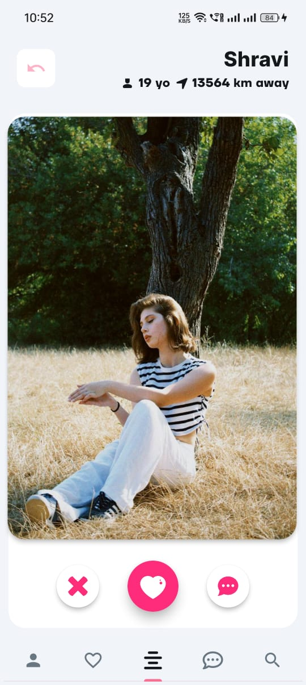
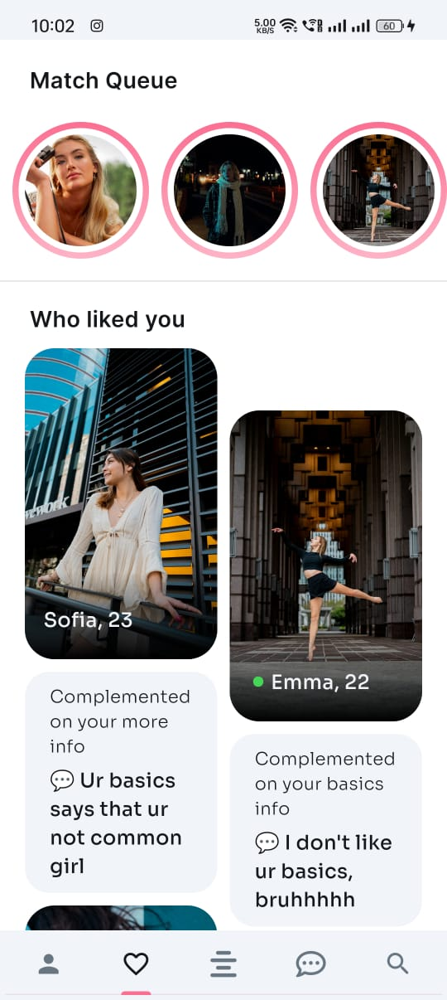
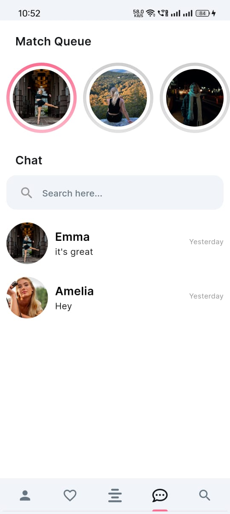
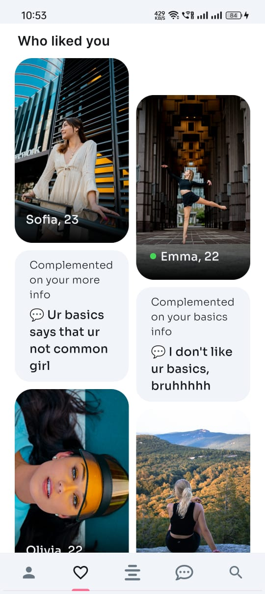

# Dazel Dating App Source Code

Welcome to the of the Dazel Dating App, an advanced dating platform developed with Flutter, FlutterFlow, Node.js, and MongoDB.

## Key Features Demonstrated
- **Matching Algorithm (Skill: DSA)**
- **Real-time Chat**
- **Geolocation-based Matching**
- **Explore Section for Best Recommendation of Profile (DSA concept)**
- **Match Based on more than 30 parameters**
- **Data Encryption and Security**

## Check out the video showcase of the Dazel Dating App on YouTube:

## Getting Started
To explore the features showcased in the Dazel Dating App, follow these steps:

1. Clone the repository: git clone https://github.com/gauravmasand/dazel-dating-app-flutter.git

2. **Navigate to the project directory:**
cd dazel-dating-app-flutter

3. **Install dependencies:**
flutter pub get

4. **Run the app:**
flutter run

## Screenshots

## Contributing
Contributions are welcome! If you have any feedback or suggestions, feel free to reach out.
---

Explore the cutting-edge features of the Dazel Dating App and witness the future of online connections. For any inquiries or collaboration opportunities, don't hesitate to contact us. Let's innovate together! 🚀
